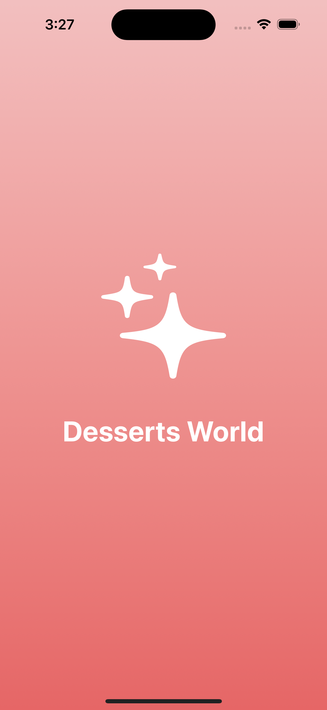

# Dessert Recipes iOS App

Welcome to the Dessert Recipes iOS App! This manual will guide you through setting up, running, and using the app.

## Table of Contents
1. [Introduction](#introduction)
2. [Prerequisites](#prerequisites)
3. [Setup and Installation](#setup-and-installation)
4. [Running the App](#running-the-app)
5. [Using the App](#using-the-app)
6. [Features Overview](#features-overview)
7. [Troubleshooting](#troubleshooting)

---

## Introduction

The Dessert Recipes iOS App allows users to browse, view, and enjoy various dessert recipes. With a sleek and modern UI, the app provides a pleasant user experience to find and explore new dessert recipes.

## Prerequisites

Before you begin, ensure you have the following:
- A Mac with macOS
- Xcode installed (latest version recommended)
- An internet connection

## Setup and Installation

### Step 1: Clone the Repository
Clone the project repository to your local machine using the following command in the terminal:

```sh
gh repo clone Sumith-Pevekar/DessertRecipes-iOS-App
```

### Step 2: Open the Project in Xcode
1. Open Xcode.
2. Select `File` > `Open` and navigate to the directory where you cloned the project.
3. Select the `DessertRecipes.xcodeproj` file to open the project.

## Running the App

1. Select the desired simulator or a connected device from the toolbar.
2. Click the `Run` button (a play icon) or press `Cmd+R` to build and run the project.
3. Wait for the app to compile and launch on the simulator or device.

## Using the App

### Splash Screen
Upon launching, the app displays a splash screen with an animation. The splash screen lasts for a few seconds before transitioning to the main screen.


### Main Screen
The main screen features a grid of dessert images. You can scroll through the list to browse various dessert recipes.

- **Navigating Recipes**: Tap any dessert image to view its detailed recipe.
- **Bottom Navigation Bar**: Use the bottom navigation bar to switch between different sections like Home, Favorites, Top, and Settings. (future development)

### Recipe Detail Screen
The recipe detail screen provides detailed information about the selected dessert, including:
- An image of the dessert
- The name of the dessert
- Detailed instructions
- A list of ingredients

## Features Overview

### Grid View of Desserts
- Displays a grid of dessert images.
- Images are loaded dynamically from the API.

### Detailed Recipe View
- Shows a large image of the dessert.
- Includes detailed instructions and ingredients.

### Marquee Text for Long Names
- If a dessert name is too long, it scrolls horizontally in a marquee style.

## Troubleshooting

### Common Issues
1. **Xcode Errors**: Ensure you are using the latest version of Xcode and macOS.
2. **Network Issues**: Check your internet connection if images or recipes are not loading.
3. **Simulator Issues**: Reset the simulator if it behaves unexpectedly. Go to `Device` > `Erase All Content and Settings`.

---

By following this manual, you should be able to set up, run, and use the Dessert Recipes iOS App with ease. Enjoy exploring and making delicious desserts!
